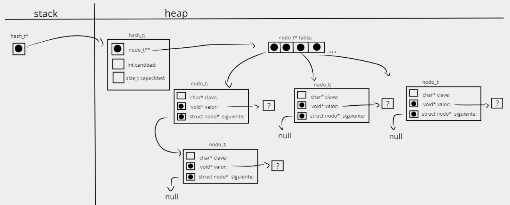

<div align="right">

</div>

# TDA HASH

## Repositorio de Marianela Fernanda Gareca Janko - 109606 - fernanda.gareca321@gmail.com

- Para compilar:

```bash
make pruebas_chanutron
```

- Para ejecutar:

```bash
./pruebas_chanutron
```

- Para ejecutar con valgrind:
```bash
make valgrind-chanutron
```
---
##  Funcionamiento

Consiste en implementar un diccionario que es una estructura que almacena elementos con clave y valor, la cual mediante la función de hash nos devuelve una posición en la tabla de hash, la cual hace más directo el acceso a la hora de buscar los elementos, reduciendo la complejidad de búsqueda o haciéndola tender a o(1) en el caso que no hayan colisiones.


## Estructuras:


En las estructuras de hash use un vector dinamico de punteros a nodos para la tabla de hash ,otro campo cantidad para llevar una cuenta de cuantas claves almacenas tiene el hash ,tambien un campo capacidad para saber cual es el tamaño de la tabla.

```c

struct hash {
	nodo_t **tabla;
	int cantidad;
	size_t capacidad;
};
```
La estructura de nodos contiene un string para guardar las clave que sera una cadena de caracteres,tambien hay un campo para el valor que puede ser cualquier cosa por eso el tipo es `void*` y por ultimo tiene un puntero al siguiente nodo que puede colicionar en la misma posicion.
```c
typedef struct nodo {
	char *clave;
	void *valor;
	struct nodo *siguiente;
} nodo_t;

```
## Funcionamiento de la memoria
En el archivo `hash.c` en la función `hash_crear` se crea un puntero a un hash reservando memoria en el heap, que contiene un puntero a un vector de punteros a nodos en el heap donde cada posición apunta a un nodo que podría enlazarse con otro nodo, también se crean dos campos uno para la cantidad de elementos y otro para la capacidad del vector

En la función `crear_nuevo_nodo` se crea un puntero a nodo en el que se reserva memoria en el heap, el cual tiene un puntero al siguiente nodo que se le enlace, junto con un campo para la clave y el valor.


<div align="center">

</div>

---

## Respuestas a las preguntas teóricas


# diccionario
<div align="center">

</div>

# Metodos de resolucioon de coliciones 
<div align="center">

</div>